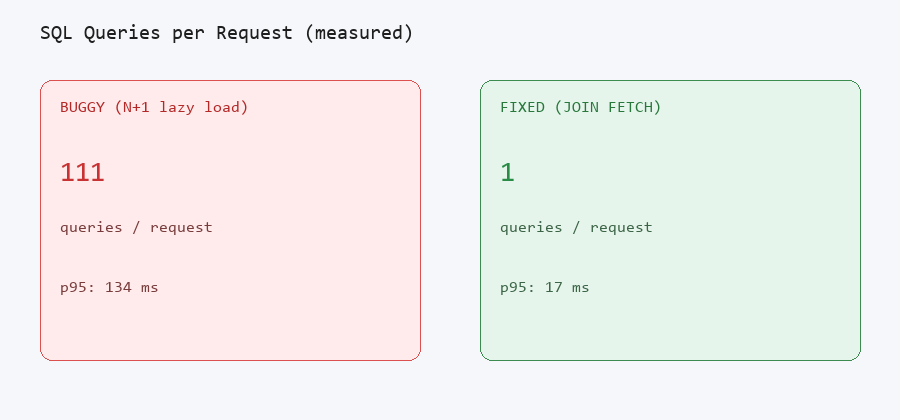

# 111 SQL Queries Per Request to 1: Spring Boot Performance Case Study

Slow APIs often look fine in a single curl, then collapse under real traffic because Hibernate is firing hidden SELECTs on every row. This case study proves the root cause and the fix with measured before/after numbers: **111 queries to 1**, **p95 134 ms to 17 ms**, plus the same N+1 failure class resolved at Careem (**p99 8s to under 1s**, **1,286 queries to 2 batch calls**).

**For hiring teams and clients:** Evidence you can verify locally in Docker. No promises without proof.

---

## Why this matters

| If you are... | What you need | What this repo shows |
|---------------|---------------|----------------------|
| **Upwork client** | Stop paying for guesswork; get a written deliverable | Audit PDF template, fixed-scope Phase 1 SOW, reproducible before/after |
| **Hiring manager / tech lead** | Someone who has seen production pain and can quantify impact | Careem production fix + documented JOIN FETCH decision with EXPLAIN |
| **Recruiter** | Scannable proof in 10 seconds | Spring Boot, PostgreSQL, concrete metrics table below |
| **Founder / PM** | Understand cost of invisible DB problems | Query amplification, latency under load, scoped audit framing |

Your users are waiting on every extra round trip. This repo shows how to find the leak, fix it, and prove the improvement on the same hardware.

---

## Results at a glance

Load test: k6, 10 VUs, 30s, `http://localhost:8080`. Seed: 10 users x 10 orders x 10 items = 100 orders, 1,000 line items. Measured Jun 16, 2026 (re-run via `scripts/capture-portfolio-assets.ps1`).

| Mode | SQL queries / request | k6 p95 (ms) | k6 avg (ms) | Throughput (req/s) |
|------|----------------------|-------------|-------------|-------------------|
| **Before** (`/api/orders/buggy`) | 111 | **134** | 60 | 62.2 |
| **After** (`/api/orders/fixed`) | 1 | **17** | 11 | 89.3 |
| **Improvement** | 111x fewer queries | **7.9x faster p95** | 5.5x faster avg | 1.4x more throughput |

**Production reference (Careem, same failure class):** p99 ~8s to under 1s, 1,286 SQL round trips to 2 batch calls. See [docs/CAREEM-WAR-STORY.md](docs/CAREEM-WAR-STORY.md).

Query counts come from a Hibernate `StatementInspector` (response header `X-Query-Count` and `/api/orders/stats/*`).



---

## What you get

This is not a technology laundry list. It is an audit-ready deliverable pack:

| Deliverable | What it proves | Path |
|-------------|----------------|------|
| **Before/after metrics** | Measurable impact on latency, throughput, query count | Metrics table above + [docs/images/](docs/images/) |
| **Audit report (sample)** | Consultant-grade executive summary and P0/P1/P2 matrix | [docs/audit-report-template.md](docs/audit-report-template.md) |
| **Phase 1 SOW** | Fixed scope, clear boundaries, acceptance criteria | [docs/PHASE-1-AUDIT-SOW.md](docs/PHASE-1-AUDIT-SOW.md) |
| **EXPLAIN ANALYZE walkthrough** | Root cause visible in the query plan | [docs/explain-analyze.md](docs/explain-analyze.md) |
| **Portfolio visuals** | Proposal-ready screenshots and captions | [PORTFOLIO-ASSETS.md](PORTFOLIO-ASSETS.md) |
| **Upwork blurb** | Paste-ready proposal hook | [UPWORK-BLURB.md](UPWORK-BLURB.md) |
| **Day-one checklist** | First 2 hours on a real rescue engagement | [docs/FIRST-2-HOURS-CHECKLIST.md](docs/FIRST-2-HOURS-CHECKLIST.md) |

Visual one-pager: [docs/portfolio-preview.html](docs/portfolio-preview.html).

---

## The problem, fix, and proof

### Problem

`GET /api/orders` loads 100 orders with 10 line items each. The buggy path uses `FetchType.LAZY` on `Order.items` and `Order.user`, then maps every order in a loop. Hibernate issues one SELECT for orders, then one SELECT per order for items, plus user lookups (**111 SQL statements** on seeded data).

Under 10 concurrent users (k6), p95 latency hits **134 ms** with **62.2 req/s** throughput.

### Buggy code

Repository uses plain `findAll()` with no fetch plan:

```java
List<Order> orders = orderRepository.findAll();
return orders.stream().map(this::mapOrderWithLazyLoads).toList();
```

Service intentionally touches lazy associations per order:

```java
private OrderSummaryDto mapOrderWithLazyLoads(Order order) {
    String customerName = order.getUser().getName();      // N user SELECTs (L1-cached per user)
    List<OrderItemDto> items = order.getItems().stream()  // N item SELECTs
        .map(...)
        .toList();
    return toSummary(order, customerName, items);
}
```

**Endpoint:** `GET /api/orders/buggy`  
**Measured:** `X-Query-Count: 111` for 100 orders (see `/api/orders/stats/buggy`)

### Fix

`JOIN FETCH` on the hot read path loads orders, users, and items in a single round trip:

```java
@Query("""
        SELECT DISTINCT o FROM Order o
        JOIN FETCH o.user u
        JOIN FETCH o.items i
        ORDER BY o.id, i.id
        """)
List<Order> findAllOrdersWithItemsAndUser();
```

#### Why JOIN FETCH (not @EntityGraph or batch size)

| Approach | Chosen? | Reason |
|----------|---------|--------|
| **JOIN FETCH** | Yes | One explicit query, easy to EXPLAIN, predictable for list endpoints |
| @EntityGraph | No | Same SQL, but less visible in code review; harder to show in audit |
| `default_batch_fetch_size` | No | Hides N+1 (drops to ~10 queries), masks the failure mode in review |
| DTO projection | Good at scale | Overkill for this case study; JOIN FETCH is the minimal fix |

**Endpoint:** `GET /api/orders/fixed`  
**Measured:** `X-Query-Count: 1` for 100 orders

### From case study to your production system

This repo is a **controlled reproduction of a production failure class**, not a copy of a client codebase. Production systems add connection pools, caches, read replicas, external APIs, and deploy history that can mask or multiply ORM issues.

**What this case study proves:** A repeatable audit sequence (baseline query count, one EXPLAIN, prioritized fix, re-measure on same hardware).

**What Phase 1 guarantees on real work:** One hot endpoint audited with measured evidence and a P0/P1/P2 report ([docs/PHASE-1-AUDIT-SOW.md](docs/PHASE-1-AUDIT-SOW.md)). Not a promise that every slow API is N+1.

---

## Portfolio assets

| Image | Description |
|-------|-------------|
| [k6-buggy-results.png](docs/images/k6-buggy-results.png) | k6 output, before fix: p95 134 ms |
| [k6-fixed-results.png](docs/images/k6-fixed-results.png) | k6 output, after fix: p95 17 ms |
| [query-count-comparison.png](docs/images/query-count-comparison.png) | 111 vs 1 queries per request |
| [explain-buggy.png](docs/images/explain-buggy.png) | EXPLAIN ANALYZE N+1 item scan |
| [explain-fixed.png](docs/images/explain-fixed.png) | EXPLAIN ANALYZE JOIN path |
| [architecture-diagram.png](docs/images/architecture-diagram.png) | Buggy loop vs JOIN FETCH flow |
| [metrics-comparison.png](docs/images/metrics-comparison.png) | Before/after bar chart |

Full upload guide: [PORTFOLIO-ASSETS.md](PORTFOLIO-ASSETS.md).

---

## Run it locally

### One command

```bash
cd spring-perf-rescue-lab
docker compose up --build
```

Wait for health, then:

```bash
curl http://localhost:8080/actuator/health
curl -s -D - http://localhost:8080/api/orders/buggy -o /dev/null | grep X-Query-Count
curl -s -D - http://localhost:8080/api/orders/fixed -o /dev/null | grep X-Query-Count
```

### Load test (k6)

```bash
k6 run -e BASE_URL=http://localhost:8080 -e ENDPOINT=/api/orders/buggy -e MODE=buggy load/k6-load.js
k6 run -e BASE_URL=http://localhost:8080 -e ENDPOINT=/api/orders/fixed -e MODE=fixed load/k6-load.js
```

Or run both:

```bash
bash scripts/run-benchmark.sh
```

### EXPLAIN ANALYZE

See [docs/explain-analyze.md](docs/explain-analyze.md) for SQL commands and sample output.

```bash
docker compose exec postgres psql -U perf -d perf_lab
```

---

## API endpoints

| Endpoint | Purpose |
|----------|---------|
| `GET /api/orders/buggy` | N+1 path, full JSON payload |
| `GET /api/orders/fixed` | JOIN FETCH path, full JSON payload |
| `GET /api/orders/stats/buggy` | Query count only (lightweight) |
| `GET /api/orders/stats/fixed` | Query count only (lightweight) |
| `GET /actuator/health` | Health check |

---

## Links

| Resource | Path |
|----------|------|
| Phase 1 audit SOW (proposals) | [docs/PHASE-1-AUDIT-SOW.md](docs/PHASE-1-AUDIT-SOW.md) |
| Audit PDF template (sample filled) | [docs/audit-report-template.md](docs/audit-report-template.md) |
| Careem production mapping | [docs/CAREEM-WAR-STORY.md](docs/CAREEM-WAR-STORY.md) |
| First 2 hours checklist | [docs/FIRST-2-HOURS-CHECKLIST.md](docs/FIRST-2-HOURS-CHECKLIST.md) |
| EXPLAIN ANALYZE guide | [docs/explain-analyze.md](docs/explain-analyze.md) |
| Portfolio pack | [PORTFOLIO-ASSETS.md](PORTFOLIO-ASSETS.md) |
| Upwork portfolio blurb | [UPWORK-BLURB.md](UPWORK-BLURB.md) |
| Portfolio images | [docs/images/](docs/images/) |
| k6 load script | [load/k6-load.js](load/k6-load.js) |

---

## Stack

- Java 17, Spring Boot 3.2, Spring Data JPA
- PostgreSQL 16
- Docker Compose (app + database)
- k6 for load testing
